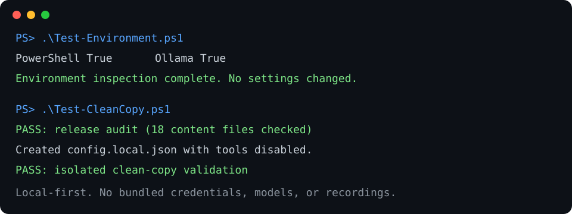

# Offline Voice Assistant Starter Kit

Local-first reference project for a Windows voice assistant using free components:

- Ollama for local language-model inference
- whisper.cpp for local speech recognition
- Piper for local text-to-speech
- PowerShell for orchestration and supervision

This publication candidate contains no model weights, installers, credentials, personal memories, private conversations, machine-specific paths, or telemetry.

## Status

Early public release. It provides reproducible validation and setup scaffolding, but deliberately does not bundle third-party executables or models.

## Seven-day Windows readiness pilot

We are validating demand for one narrowly scoped, 45-minute Windows offline-assistant readiness session at a future pilot price of **$35**. The validation period accepts expressions of interest only: no payment is requested or accepted, and submitting the form does not guarantee selection.

If you have a Windows machine and want help assessing whether local speech recognition, local language models, and local speech synthesis are practical on it, [submit the public readiness pilot form](../../issues/new?template=pilot-readiness.yml).

The form asks only for Windows version, basic hardware, timezone, and the desired outcome. Do not include credentials, addresses, private recordings, account information, or sensitive file paths.

## Opt-in project support call pilot

We are also testing whether people want a short, manual call about the open-source project and ways to support its continued development. Calls are **opt-in only**—no cold calling, robocalls, AI-generated calling, purchased lists, or scraped phone numbers.

[Express interest through the public call-pilot form](../../issues/new?template=call-pilot-interest.yml). Do not post a phone number or other private contact information. A submission records interest only; it does not authorize an immediate call, request payment, or guarantee follow-up.

## Quick start

1. Run `powershell -NoProfile -ExecutionPolicy Bypass -File .\Test-Environment.ps1`.
2. Read `PREFLIGHT.md` and install missing upstream tools from their official projects.
3. Run `powershell -NoProfile -ExecutionPolicy Bypass -File .\Initialize-Assistant.ps1`.
4. Edit the generated `config.local.json` and replace every placeholder.
5. Run `powershell -NoProfile -ExecutionPolicy Bypass -File .\Verify-Release.ps1 -RuntimeCheck`.
6. Run `powershell -NoProfile -ExecutionPolicy Bypass -File .\Start-Assistant.ps1`.

See `DEMO.md` for a non-destructive demonstration and `TESTING.md` for the clean-copy test procedure.

The included launcher is intentionally conservative: push-to-talk by default, loopback-only services, no purchasing or messaging tools, and no automatic external actions.

## What this kit does not promise

It is not a hosted service, a copy of any cloud model, an autonomous financial agent, or a safety-certified control system. Local model quality and speed depend heavily on hardware and selected model sizes.

## License

Project-authored files are offered under the MIT License in `LICENSE`. Ollama, whisper.cpp, Piper, and individual models retain their own licenses; users must review those licenses independently.
